# k0rdent KSM Tests

End-to-end tests for **KSM**, the layer of [k0rdent KCM](https://github.com/k0rdent/kcm)
that turns a `MultiClusterService` into services running on a cluster.

Everything is a shell script, so CI runs exactly what you run locally. One scenario
is one YAML file; adding a test means adding that file, nothing else.

> [!NOTE]
> Tests run in **self-management** mode: the `MultiClusterService` targets the
> management cluster itself, so a scenario needs one k0s-in-docker cluster and
> nothing else. No second cluster, no `ClusterDeployment`, no cloud credentials,
> no cost.

## A run, end to end

Four phases. `deploy_k0rdent.sh` does the first, `run_scenario.sh` the middle two
and the services half of the last, `remove_k0rdent.sh` the rest.

```mermaid
flowchart LR
    subgraph P1["1 · env"]
        direction LR
        E1["build or pull<br/>KCM"] --> E2["k0s cluster<br/>in docker"] --> E3["install KCM<br/>+ Management"]
    end

    subgraph P2["2 · deploy"]
        direction LR
        D1["ServiceTemplates"] --> D2["MultiClusterService<br/>+ wait"]
    end

    subgraph P3["3 · upgrade"]
        direction LR
        U1["bump versions"] -.- U2["or walk<br/>a chain"]
    end

    subgraph P4["4 · cleanup"]
        direction LR
        C1["remove<br/>services"] --> C2["remove<br/>cluster"]
    end

    P1 --> P2 --> P3 --> P4

    classDef env fill:#dbeafe,stroke:#2563eb,color:#0b1220
    classDef dep fill:#ede9fe,stroke:#7c3aed,color:#0b1220
    classDef upg fill:#fef3c7,stroke:#d97706,color:#0b1220
    classDef out fill:#dcfce7,stroke:#16a34a,color:#0b1220

    class E1,E2,E3 env
    class D1,D2 dep
    class U1,U2 upg
    class C1,C2 out
```



<sub>Phase 3 runs only for the scenarios that declare `upgrade:` or `templateChain:`;
the others go straight from deploy to cleanup. Every box is one script in
`scripts/steps/`, and CI runs them as separate steps, so a red job says where it
broke without anyone opening a log.</sub>

What the scenario asks for, and where it ends up:

```mermaid
flowchart LR
    Y["scenario YAML"] --> M["MultiClusterService"]
    M --> S["ServiceSet<br/><small>spec: what may be applied now</small>"]
    S --> P["sveltos Profile<br/><small>spec.helmCharts, in order</small>"]
    P --> H["helm releases<br/><small>in the target cluster</small>"]
    H -- "poller writes back" --> ST["ServiceSet.status<br/><small>what the checks read</small>"]

    classDef ours fill:#ede9fe,stroke:#7c3aed,stroke-width:1px,color:#0b1220
    classDef kcm fill:#dbeafe,stroke:#2563eb,stroke-width:1px,color:#0b1220
    classDef sveltos fill:#ffe4e6,stroke:#e11d48,stroke-width:1px,color:#0b1220
    classDef cluster fill:#dcfce7,stroke:#16a34a,stroke-width:1px,color:#0b1220

    class Y ours
    class M,S,ST kcm
    class P sveltos
    class H cluster

    linkStyle 4 stroke:#16a34a,stroke-width:1px,stroke-dasharray:4 3
```



<sub>Purple is yours, blue is KCM/KSM, red is sveltos, green is the cluster — the
dashed edge is the only one pointing back, and it is what every assertion reads.</sub>

## Scenarios

| Scenario | Asserts |
|---|---|
| `101_basic` | one service reaches the cluster and can be removed |
| `201_svcdep` | a `dependsOn` chain deploys in order |
| `202_svcdep_invalid` | an invalid service stops the rollout: nothing behind it runs, nothing before it is rolled back |
| `301_upgrade` | upgrading one service leaves the others untouched |
| `302_upgrade_invalid_atomic` | a failed atomic upgrade returns to the previous healthy state |
| `401_mcsdep_valid` | a dependent `MultiClusterService` waits for the one it depends on |
| `402_mcsdep_invalid` | a broken dependency holds the dependent back for good |
| `501_no_chain` | with no `ServiceTemplateChain`, any version is reachable |
| `502_chain_boundary` | a chain offering nothing refuses every upgrade |
| `503_direct_chain` | only what the chain lists is accepted |
| `504_stepwise_chain` | a multi-hop chain is walked, not skipped |

Every scenario runs against each KCM build in
[`scripts/config/kcm-variants.yaml`](scripts/config/kcm-variants.yaml) — today
`src: main` and `release: 1.12.0-rc.3`. Install, `Management` reconcile and teardown
are asserted too, because KSM sits on them. Cloud provisioning is out of scope.

## Quick start

```bash
export KCM=1.12.0-rc.3          # a chart version, or a git ref with KCM_MODE=source
./scripts/deploy_k0rdent.sh     # k0s-in-docker cluster "k0rdent-$KCM" + KCM, ~7 min

SCENARIO=201_svcdep ./scripts/run_scenario.sh   # deploy, assert, remove

./scripts/remove_k0rdent.sh 1   # the # column of ./scripts/k0rdent_clusters.sh
```

| Command | What it answers |
|---|---|
| `./scripts/scenarios.sh` | which scenarios exist |
| `./scripts/k0rdent_clusters.sh` | which clusters exist, and which one `kcfg_k0rdent` points at |
| `SCENARIO_KEEP=true ./scripts/run_scenario.sh` | same run, but leave the services up to poke at |
| `./scripts/clean_scenario.sh` | remove what `SCENARIO_KEEP=true` left behind |
| `./scripts/tests/bash/run.sh` | the unit tests — no cluster needed |

Several clusters can exist side by side; `kcfg_k0rdent` is a symlink to whichever
one the scenarios talk to, so switching is `ln -sfn kcfg_k0rdent_<KCM> kcfg_k0rdent`.

## Adding a scenario

Drop a file in [`test_scenarios/`](test_scenarios). Nothing else needs editing:
`./scripts/scenarios.sh` and CI both discover it, and CI works out which steps it
exercises from the blocks it uses.

```yaml
name: 601_thing          # must match the filename
group: Some area         # heading in ./scripts/scenarios.sh
description: What it proves.

services:
  - name: traefik
    chart: traefik
    version: 41.2.0
    repo: oci://ghcr.io/k0rdent/catalog/charts
    namespace: traefik
    waitForPods: traefik-    # optional
    dependsOn: cert-manager  # optional
    values: |                # optional
      traefik:
        ...
```

Optional blocks, each switching on extra checks:

| Block | Asserts |
|---|---|
| `expect: {failed, deployed, blocked}` | the rollout stops at `failed`, `blocked` never installs, `deployed` survives |
| `upgrade: {services, expect}` | only `rolledOut` moves; `untouched` keeps its chart *and* its pod UIDs |
| `templateChain` + `upgrade.steps` | each step is `applied` or `rejected` as the chain dictates |
| `multiClusterServices` | replaces `services:` when a scenario needs more than one MCS |

> [!IMPORTANT]
> KCM runs its own cert-manager in this cluster and its helm release owns the
> cert-manager CRDs. A scenario deploying cert-manager must set
> `crds.enabled: false` and a `fullnameOverride`, or helm refuses to import
> resources another release already owns. That is the price of self-management:
> the services land in a cluster that is not empty.

> [!WARNING]
> Scenarios are **not** isolated from each other on a shared cluster:
> `202_svcdep_invalid` breaks cert-manager on purpose, so anything after it that
> needs cert-manager fails too. Sharing a cluster is a debugging convenience, not
> a substitute for CI.

## Layout

```
test_scenarios/     one YAML per scenario -- the whole test definition
scripts/            the entry points above; everything you run by hand
  steps/            one script per pipeline step, 1:1 with the steps in CI
  utils/            subroutines the steps call; never run directly
  lib/              shared helpers; services.sh reads the scenario files
  config/           KCM values, the Management object, the CI matrix
  tests/bash/       unit tests for the scripts, no cluster needed
.github/workflows/  e2e.yml picks what to run, e2e-scenario.yml runs it
```

## CI

A pull request runs only what the change can reach; `main` and nightly run the whole
matrix. The variants come from `scripts/config/kcm-variants.yaml`, so adding a KCM
version is a change to that file alone.

<details>
<summary><b>Troubleshooting a local run</b></summary>

**The scenario hangs on "waiting for the MultiClusterService to disappear".**
Something in the chain cannot be uninstalled. Look at the ClusterSummary:

```bash
export KUBECONFIG=kcfg_k0rdent
kubectl get clustersummary -A -o jsonpath='{range .items[*]}{.status.featureSummaries[*].failureMessage}{"\n"}{end}'
kubectl logs -n projectsveltos deploy/addon-controller --tail=50 | grep -i uninstall
```

**A ServiceTemplate never becomes valid.** Usually the cluster is under disk
pressure and the controllers were evicted — `df -h /` on the host, then
`kubectl describe node | grep -A8 Conditions`. A source build needs ~15% free.

**Everything looks stuck after a failed run.** Diagnostics for the last run are
in `logs*/`; `./scripts/steps/collect_logs.sh` refreshes them.

</details>
