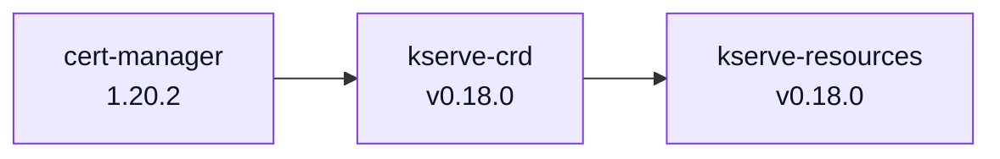
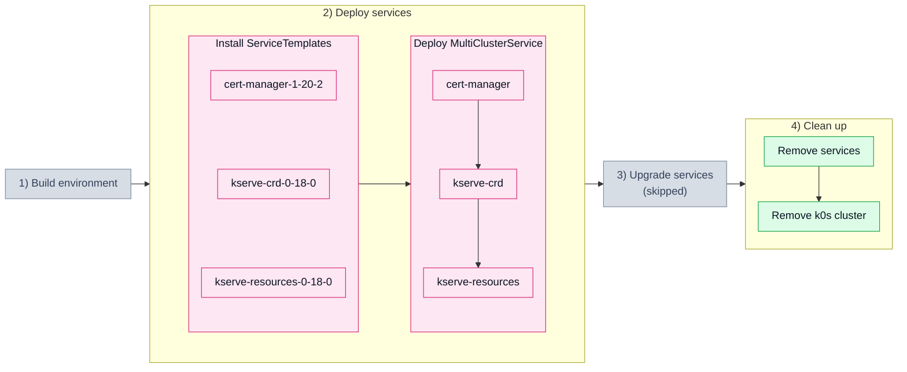

# 2.1. Service dependency (201_svcdep)

## Description

A valid `dependsOn` chain: every service is correct, so all of them must land — and
in the declared order, not at once. The chain is the one from catalog's `apps/kserve`:
cert-manager issues the webhook certificates, the CRDs have to exist before the
controller that owns instances of them.



## What is asserted

| Step | Check |
|---|---|
| Install ServiceTemplates | each of the three `ServiceTemplate` objects reports `valid` before anything is deployed |
| Deploy MultiClusterService | KCM turns the MCS into a `ServiceSet` — a missing one means the selector never matched |
| | every service has a **deployed helm release** in the target cluster, waited for in the declared order; the namespace existing is not enough, because namespaces outlive the scenario that made them |
| | pods matching `waitForPods` are ready — `cert-manager-` and `kserve-controller-manager-`; `kserve-crd` ships only CRDs, so it has nothing to wait for |
| | the MCS reports `ClusterInReadyState`, so KCM has accepted the rollout rather than the test having merely seen the workloads come up |
| Remove services | the MCS disappears, and no `ServiceSet` of its own survives it |
| | no helm release is left for any of the three services — a release record can outlive an emptied namespace and break the next scenario |
| | no Deployment, DaemonSet or StatefulSet is left in `cert-manager` or `kserve` |

What this proves about dependencies is indirect but real: a dependent that KSM
released too early cannot reach a deployed release while the chart it needs is
missing, so the per-service wait fails and the scenario goes red. The order itself
is asserted directly in the unit tests; here it is the end state that has to hold.

> [!NOTE]
> The copy of cert-manager sets `crds.enabled: false` and a `fullnameOverride`,
> because KCM runs its own cert-manager here and its helm release already owns the
> cert-manager CRDs. Self-management means the services land in a cluster that is
> not empty.

## Scenario steps



Grey phases are not part of this scenario: the environment is built once and shared
by every scenario, and this one declares no `upgrade:` block, so nothing is upgraded.

## Run it

```bash
SCENARIO=201_svcdep ./scripts/run_scenario.sh
```

> [!WARNING]
> CI currently skips the `4) Clean up: Remove services` step for this scenario —
> the teardown wedges on the MCS finalizer, because the chart owning the CRDs is
> uninstalled before the release still holding a CR of them
> ([kcm#3021](https://github.com/k0rdent/kcm/issues/3021)). Known to fail on
> KCM 1.11.0, fixed between v1.11.0 and v1.12.0-rc1.

Defined in [`201_svcdep.yaml`](201_svcdep.yaml).
