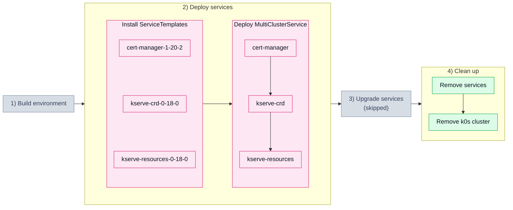

# 2.1. Service dependency (201_svcdep)

## Tested steps

1. Install the ServiceTemplates and wait for each to report `valid`.
2. Deploy one MultiClusterService carrying the whole chain.
3. `cert-manager` — deployed helm release, pods ready.
4. `kserve-crd` — deployed helm release; CRDs only, no pods to wait for.
5. `kserve-resources` — deployed helm release, controller pods ready.
6. The MCS reports `ClusterInReadyState`.
7. Remove the services: MCS, ServiceSet, helm releases and workloads all gone.

## Scenario steps

> [!WARNING]
> CI currently skips the `4) Clean up: Remove services` step for this scenario —
> the teardown wedges on the MCS finalizer, because the chart owning the CRDs is
> uninstalled before the release still holding a CR of them
> ([kcm#3021](https://github.com/k0rdent/kcm/issues/3021)).

Defined in [`201_svcdep.yaml`](201_svcdep.yaml).
