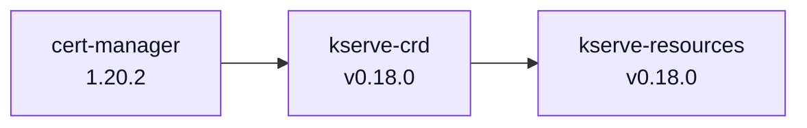
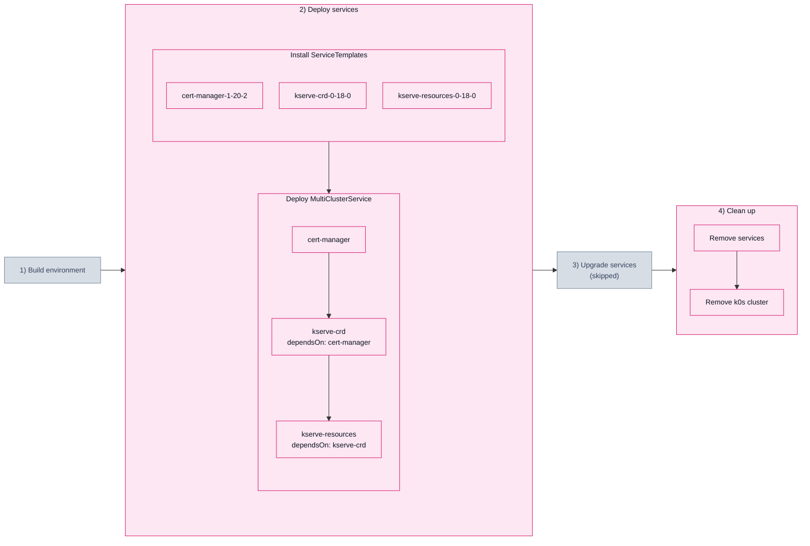

# 2.1. Service dependency (201_svcdep)

## Description

A valid `dependsOn` chain: every service is correct, so all of them must land — and
in the declared order, not at once. The chain is the one from catalog's `apps/kserve`:
cert-manager issues the webhook certificates, the CRDs have to exist before the
controller that owns instances of them.



The scenario asserts that each service reaches the cluster only once the one it
depends on is deployed, and that all three can then be removed again.

> [!NOTE]
> The copy of cert-manager sets `crds.enabled: false` and a `fullnameOverride`,
> because KCM runs its own cert-manager here and its helm release already owns the
> cert-manager CRDs. Self-management means the services land in a cluster that is
> not empty.

## Scenario steps



Grey phases are not part of this scenario: the environment is built once and shared
by every scenario, and this one declares no `upgrade:` block, so nothing is upgraded.

## Run it

```bash
SCENARIO=201_svcdep ./scripts/run_scenario.sh
```

> [!WARNING]
> CI currently skips the `4) Clean up: Remove services` step for this scenario —
> the teardown wedges on the MCS finalizer, because the chart owning the CRDs is
> uninstalled before the release still holding a CR of them
> ([kcm#3021](https://github.com/k0rdent/kcm/issues/3021)). Known to fail on
> KCM 1.11.0, fixed between v1.11.0 and v1.12.0-rc1.

Defined in [`201_svcdep.yaml`](201_svcdep.yaml).
