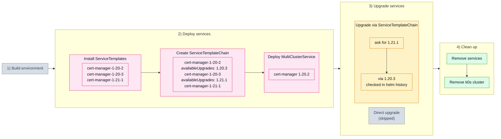

# 5.4. Stepwise chain (504_stepwise_chain)

## Tested steps

1. Install the ServiceTemplates for all three versions and wait for each to report `valid`.
2. Create the ServiceTemplateChain: `1.20.2 → 1.20.3 → 1.21.1`.
3. Deploy one MultiClusterService with `cert-manager` on `1.20.2`, pods ready.
4. Ask for `1.21.1`: the helm release has to end up on that version, `deployed`.
5. Check the helm history for `1.20.3` — the chain says the route goes through it,
   so reaching the target without it is a failure. History, not live watching: the
   intermediate version can be too brief to catch.
6. Remove the services: MCS, ServiceSet, helm releases and workloads all gone.

## Scenario schema

> [!WARNING]
> Known failure on KCM 1.11.0 in `3) Upgrade services`: the release goes straight
> from `1.20.2` to `1.21.1` in one helm upgrade. The chain is consulted — `502` and
> `503` prove that — but it constrains which versions may be reached, not the route
> taken.

Defined in [`504_stepwise_chain.yaml`](504_stepwise_chain.yaml).
